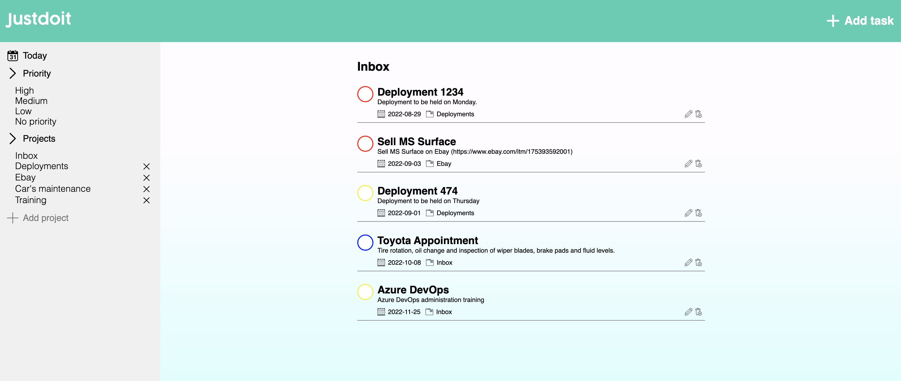

# Justdoit - Todo List

<a href="https://ronaldfer.github.io/todolist/dist">Live Demo</a>

# About the Project

Hi, Justdoit is a todo list application created using vanilla JavaScript and storage using localStorage. It helps you to manage your personal and professional productivity.

## Features

- Create, edit, and remove tasks
- Each task has name, description, due date, project, and priority
- The checkbox color is determined by the task priority
- Check task as complete and can uncheck completed tasks
- Completed tasks are moved to the bottom of the todo list and crossed out
- Create and remove projects
- Filter tasks by due today, priority, and project
- Projects and tasks are saved using localStorage

# Technologies Used

  

# Resources Used

Font: <a href="https://www.dafont.com/themes.php">Dafont </a>
\
Icons: <a href="https://www.svgrepo.com/">SVG Repo </a>

# Developer

Ronald Fernandez
